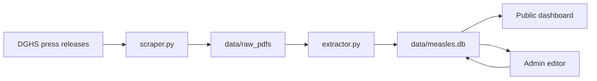

# Architecture

## Overview

`dghs-measles-dashboard` is a local-first dashboard for DGHS measles press-release PDFs.

It has four parts:

1. **Collector**: finds DGHS measles press releases and downloads PDFs.
2. **Extractor**: reads the division table from each PDF and validates the extracted rows.
3. **Database**: stores report metadata and division-level daily statistics in SQLite.
4. **Web UI**: shows public insights and a private admin review/edit page.

## Key Files

- `app.py`: Streamlit page router.
- `pages/dashboard.py`: public dashboard.
- `pages/admin.py`: admin page for PDF review and manual correction.
- `update_data.py`: command-line updater.
- `run_daily_update.ps1`: Windows Task Scheduler entrypoint.
- `measles_dashboard/scraper.py`: DGHS link discovery and PDF download.
- `measles_dashboard/extractor.py`: PDF table extraction and validation.
- `measles_dashboard/db.py`: SQLite schema and persistence helpers.
- `measles_dashboard/ui.py`: shared UI styling.

## Data Flow

## Validation

The extractor marks a report as `extracted` only when it passes safety checks. Reports are marked `needs_review` when:

- division rows cannot be found,
- totals do not match the PDF total row,
- the total row is unavailable,
- 24-hour death values are implausibly high, suggesting shifted PDF columns.

The public dashboard uses only `extracted` reports by default. The admin page can review and manually correct any report date.

